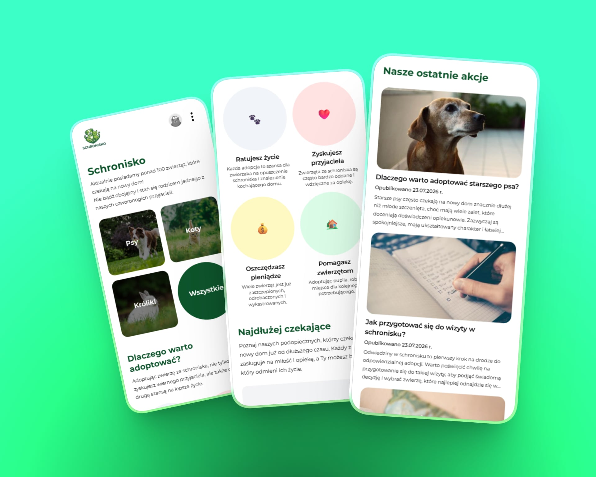
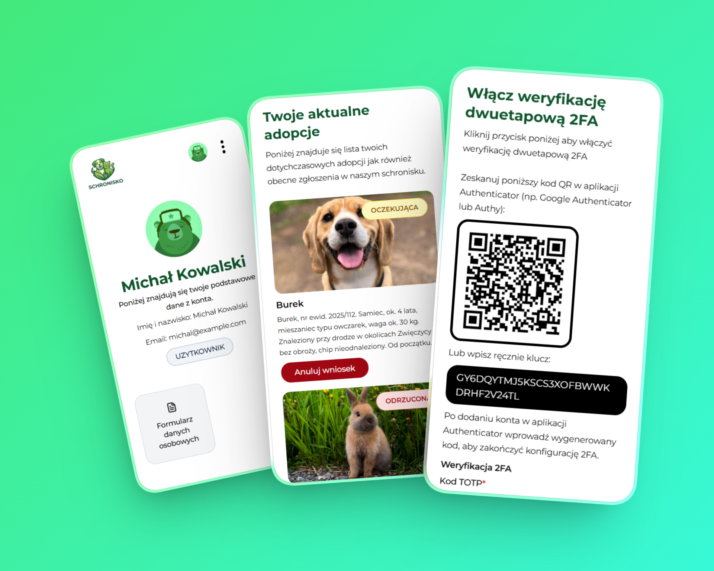
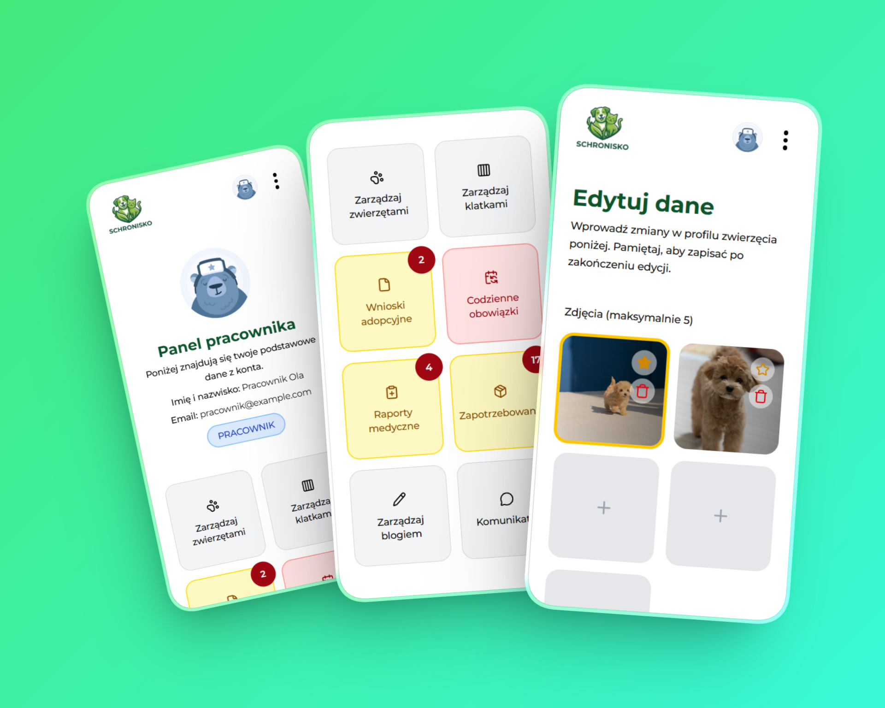
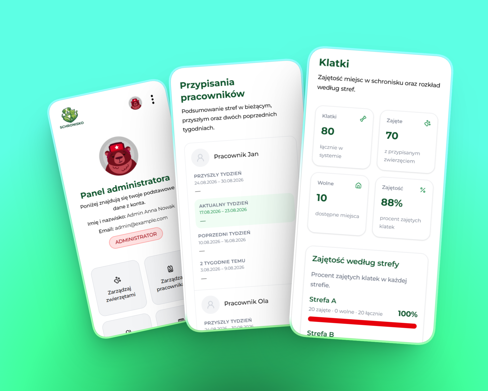
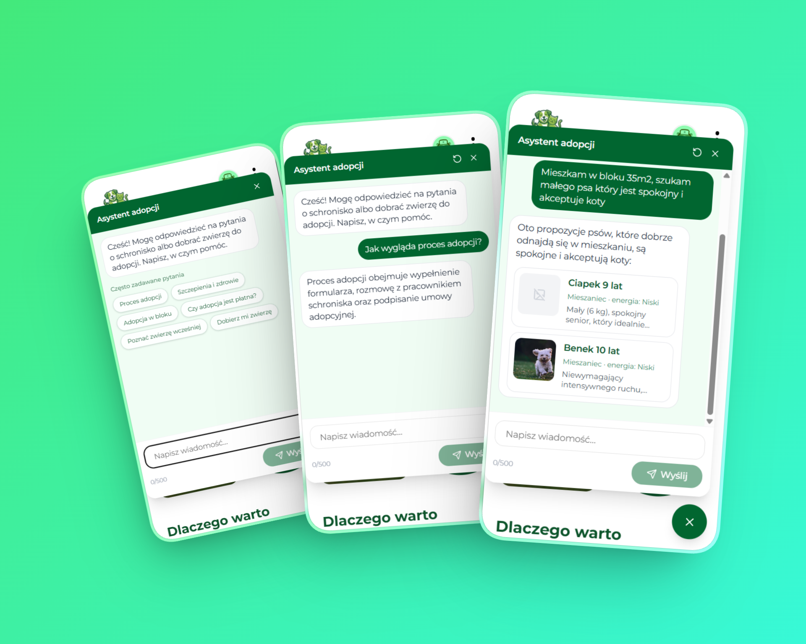

# Schronisko

Aplikacja webowa do zarządzania schroniskiem i procesem adopcji zwierząt.

W systemie występują trzy rodzaje kont: **UŻYTKOWNIK**, **PRACOWNIK** oraz **ADMINISTRATOR**.

Aplikacja umożliwia zwykłym użytkownikom łatwy i przejrzysty przebieg adopcji oraz dostęp do najważniejszych informacji o schronisku i podopiecznych. Dla pracowników i administratorów przygotowano dedykowane panele, w których w jednym miejscu zebrano funkcje potrzebne do opieki nad zwierzętami, obsługi wniosków adopcyjnych i zarządzania działalnością schroniska.

📄 [Pobierz lub zobacz pełną prezentację w formacie PDF](docs/prezentacja.pdf)

---

## Spis treści

- [Stack technologiczny](#stack-technologiczny)
- [Struktura projektu](#struktura-projektu)
- [Role i panele](#role-i-panele)
  - [Strefa publiczna](#strefa-publiczna)
  - [Panel klienta](#panel-klienta-uzytkownik)
  - [Panel pracownika](#panel-pracownika-pracownik)
  - [Panel administratora](#panel-administratora-administrator)

---

## Stack technologiczny

| Warstwa  | Technologie                                                                                                 |
| -------- | ----------------------------------------------------------------------------------------------------------- |
| Frontend | React 19, TypeScript, Vite, React Router, TanStack Query, Tailwind CSS, shadcn/Radix, React Hook Form + Zod |
| Backend  | Node.js, Express 5, Prisma 7, PostgreSQL (Neon), JWT (cookies), Nodemailer, 2FA (TOTP)                      |
| CMS      | Strapi 5 (blog)                                                                                             |
| Inne     | Supabase Storage (zdjęcia), Google Maps, Vitest                                                             |

---

## Struktura projektu

```
├── frontend/     # Aplikacja React (Vite)
├── backend/      # API Express + Prisma
└── cms/          # Strapi (blog)
└── docs/         # Dokumenty
```

## Role i panele

W systemie są trzy role: **UZYTKOWNIK**, **PRACOWNIK**, **ADMINISTRATOR**.

### Strefa publiczna

Dostęp bez logowania:

- Strona główna,
- Katalog zwierząt (psy / koty / króliki / wszystkie)
- Podstrona zwierzęcia z szczegółowymi informacjami, zgłoszenie adopcji (po zalogowaniu jako klient)
- Podstrony "Znalezione zwierzęta", „Jak pomóc?”, "Blog", "FAQ", "Kontakt"
- Ulubione zwierzęta
- Newsletter (zapis / wypisanie)
- Regulamin i polityka prywatności
- Rejestracja, logowanie, weryfikacja e-mail, reset hasła

### Panel klienta (`UZYTKOWNIK`)

Ścieżki: `/konto`, `/konto/formularz` <br />
Testowe konta: `michal@example.com`, `katarzyna@example.com`



- **Konto** — lista wniosków adopcyjnych, statusy, anulowanie oczekującego wniosku, odliczanie terminu wizyty po akceptacji
- **Formularz danych osobowych** — wymagany przed złożeniem wniosku (m.in. kontakt, adres, warunki mieszkaniowe)
- **Adopcja** — wniosek z karty zwierzęcia, potwierdzenie e-mail, powiadomienia o zmianie statusu
- **Bezpieczeństwo** — zmiana hasła, opcjonalne 2FA
- **Ulubione zwierzęta**

### Panel pracownika (`PRACOWNIK`)

Ścieżki m.in. `/pracownik/...`, wspólne `/admin/klatki`, `/admin/adopcje` <br />
Testowe konta: `pracownik@example.com`, `pracownik2@example.com`



- **Zwierzęta** — lista, dodawanie, edycja
- **Klatki** — zarządzanie klatkami / strefami
- **Adopcje** — kolejka wniosków, decyzja wstępna (akceptacja / odrzucenie / anulacja), finalizacja po spotkaniu
- **Moje obowiązki** — codzienna opieka (woda, karma, sprzątanie) w przypisanych strefach
- **Raporty medyczne** — wizyty, badania, szczepienia itd.
- **Zapotrzebowania zwierząt** — potrzeby (karma, akcesoria, leki…)
- **Konto** — dane pracownika, 2FA
- **Blog** (panel Strapi), opcjonalny komunikator zespołu

### Panel administratora (`ADMINISTRATOR`)

Testowe konta: `admin@example.com`, `admin2@example.com`



Wszystko z panelu pracownika **oraz**:

- **Pracownicy** — zarządzanie kontami personelu
- **Użytkownicy** — konta klientów, edycja, blokady
- **Weterynarze** — baza weterynarzy współpracujących ze schroniskiem
- **Statystyki** — podsumowania działalności / adopcji
- **Tydzień pracy** — przypisania stref do pracowników
- **Codzienne obowiązki** — widok globalny opieki dziennej
- pełny dostęp do zwierząt, klatek, adopcji, raportów medycznych i zapotrzebowań

### Asystent AI do pomocy w adopcji zwierząt

Asystent AI który pomoże Ci na podstawie podanych danych w rozmowie w wyborze zwierzęcia do adopcji.


